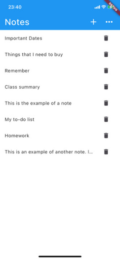
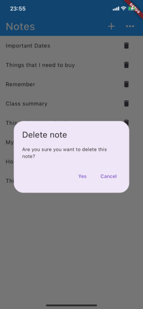

# MyNotes App - Flutter Note Taking App


MyNotes App is a simple and efficient note-taking app built with Flutter. It allows you to create and manage notes seamlessly using Firebase Authentication for user authentication and a local SQLite database for storing and retrieving notes.

## Features

- **User Authentication:** MyNotes App integrates with Firebase Authentication to provide a secure login and registration process for users.

- **Effortless Note Creation:** Create new notes quickly and easily. Capture your thoughts, ideas, and reminders on the go.

- **Note Storage with SQLite:** MyNotes App utilizes SQLite, a lightweight and reliable local database, for storing and retrieving notes efficiently.

- **Edit and Delete Notes:** Modify your existing notes or delete them when they are no longer needed.

- **Sync with Firebase:** Enable synchronization of your notes across multiple devices using Firebase Realtime Database or Cloud Firestore.

## Installation

1. Clone the repository:

```bash
git clone https://github.com/Cavalgo/mynotes
```

2. Navigate to the project directory:

```bash
cd MyNotesApp
```

3. Install dependencies:

```bash
flutter pub get
```

4. Run the app:

```bash
flutter run
```

Note: Make sure you have Flutter installed and set up on your machine before running the app.

## Dependencies

- `flutter`
- `firebase_core`
- `firebase_auth`
- `cloud_firestore`
- `sqflite`

For a complete list of dependencies, refer to the `pubspec.yaml` file.

## Screenshots




## Contributing

Contributions are welcome! If you find any issues or have suggestions for improvements, please open an issue or submit a pull request. Let's make MyNotes App even better together.

## License

This project is licensed under the MIT License. See the `LICENSE` file for more information.

---

Take quick notes with MyNotes App and keep your thoughts organized. Start using MyNotes App today!

Download MyNotes App from the [Google Play Store](https://play.google.com/store/apps/your-app-link) or [Apple App Store](https://apps.apple.com/your-app-link).